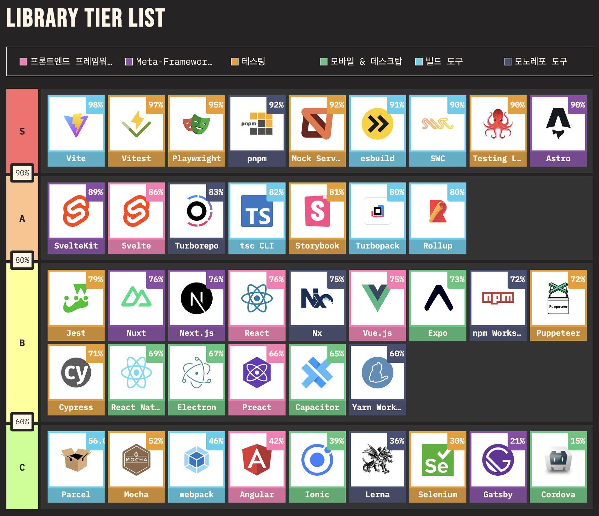

# State of JS 2023 - Tier S

[LinkedIn의 Dale Seo님 글](https://www.linkedin.com/posts/daleseo\_sateofjs-qzcstkrbvulp-activity-7219438220718092288-hIf-?utm\_source=share\&utm\_medium=member\_desktop)을 보고 인기있는 library들에 대해서 하나씩 짚어보기로 했다.

<figure><figcaption></figcaption></figure>

## 1. Vite

* 빠르고 간편한 개발 환경을 제공하는 빌드 도구. 모듈 번들링을 수행
* 사용해야 하는 이유:
  * 빠른 개발 서버 시작
  * HMR(Hot Module Replacement) 지원
  * 최적화된 프로덕션 번들
* 인기 이유:
  * 빠른 빌드 시간과 업데이트 속도
  * 간편한 설정과 사용
  * 최신 브라우저와 모듈 표준을 이용한 현대적 개발 경험
* GitHub: [Vite](https://github.com/vitejs/vite)

## 2. Vitest

* Vite 프로젝트에 통합되는 빠르고 간편한 테스트 프레임워크
* 사용해야 하는 이유:
  * Vite와의 긴밀한 통합
  * 빠른 테스트 실행 속도
  * 간단한 설정과 사용
* 인기 이유:
  * 빠른 피드백 루프
  * 사용의 간편함
  * 기존 Vite 프로젝트에 쉽게 통합 가능
* GitHub: [Vitest](https://github.com/vitest-dev/vitest)

## 3. Playwright

* 최신 브라우저를 자동화하기 위한 엔드투엔드 테스트 라이브러리
* 사용해야 하는 이유:
  * 여러 브라우저에서 테스트 가능 (Chromium, Firefox, WebKit)
  * 강력한 API로 정밀한 브라우저 제어
  * CI/CD 환경에 잘 맞는 테스트 작성 가능
* 인기 이유:
  * 크로스 브라우저 지원
  * 안정적이고 빠른 테스트 실행
* GitHub: [Playwright](https://github.com/microsoft/playwright)

## 4. pnpm

* 빠르고 디스크 공간을 효율적으로 사용하는 패키지 매니저
* 사용해야 하는 이유:
  * 모듈 설치 속도 빠름
  * 디스크 공간 절약
  * 패키지 의존성 관리 효율적
* 인기 이유:
  * 빠른 설치 및 빌드 시간
  * 단일화된 의존성 트리
  * 대형 모노레포 프로젝트에서 특히 유용
* GitHub: [pnpm](https://github.com/pnpm/pnpm)

## 5. MSW (Mock Service Worker)

* API 모킹을 위해 브라우저 및 Node.js 환경에서 사용되는 서비스 워커 기반의 라이브러리
* 사용해야 하는 이유:
  * API 의존성을 줄이고 개발 속도 향상
  * 브라우저와 Node.js 환경 모두에서 사용 가능
  * 요청/응답을 쉽게 모킹 가능
* 인기 이유:
  * 설정이 간편하고 직관적임
  * 실제 네트워크 요청과 유사한 환경 제공
  * 다양한 상황을 모킹할 수 있는 유연성
* GitHub: [MSW](https://github.com/mswjs/msw)

## 6. esbuild

* 매우 빠른 JavaScript 번들러 및 미니파이어입니다.
* 사용해야 하는 이유:
  * 번들링 속도가 매우 빠름
  * 현대적인 ES6+ 기능 지원
  * 간편한 설정
* 인기 이유:
  * 탁월한 성능
  * 간단한 설정 및 사용
  * 다양한 언어 및 프레임워크와 호환
* GitHub: [esbuild](https://github.com/evanw/esbuild)

## 7. SWC

* 빠른 JavaScript/TypeScript 컴파일러 및 번들러입니다.
* 사용해야 하는 이유:
  * 빠른 컴파일 속도
  * 최신 JavaScript 기능 지원
  * 간편한 설정
* 인기 이유:
  * 고성능 컴파일러
  * 다양한 빌드 시스템과 통합 가능
  * Rust로 작성되어 안정적이고 빠름

• GitHub: [SWC](https://github.com/swc-project/swc)

## 8. Testing Library

* React 컴포넌트를 테스트하기 위한 라이브러리. 사용자가 실제로 컴포넌트를 사용하는 방식을 모방
* 사용해야 하는 이유:
  * 접근성 및 사용자 경험에 중점
  * 직관적인 테스트 코드 작성
  * 다양한 프레임워크와 호환
* 인기 이유:
  * 간단하고 직관적인 API
  * 사용자 중심의 테스트
  * 커뮤니티 지원이 활발
* GitHub: [Testing Library](https://github.com/testing-library)

## 9. Astro

* 정적 사이트 생성기 및 현대적 프론트엔드 프레임워크. 필요한 경우에만 JavaScript를 로드
* 사용해야 하는 이유:
  * 빠른 페이지 로딩 속도
  * 사용하지 않는 JavaScript를 자동으로 제거
  * 다양한 프레임워크와 통합 가능
* 인기 이유:
  * 최적화된 성능
  * 다양한 프레임워크와 유연한 통합
  * 최신 웹 개발 트렌드를 반영
* GitHub: [Astro](https://github.com/withastro/astro)
